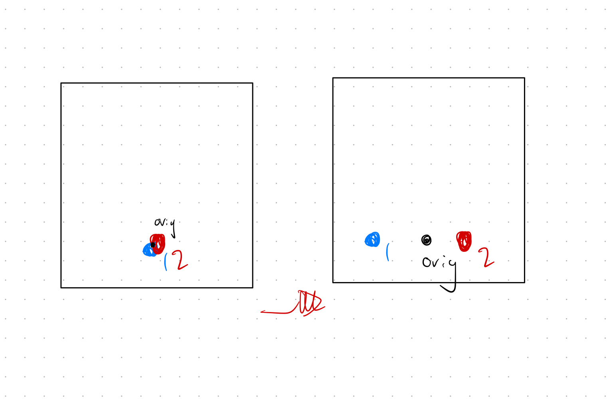

# factor-graph
library implementing barebones gbp for use with factor graphs.

what would the event loop of this integrated look like?

# MVP
- only a goal layer.
- click to assign a new goal state $x^G$.
- agents can always communicate with each other.
- they optimize to push their goal state a minimum distance apart from the other agents' goal state.

